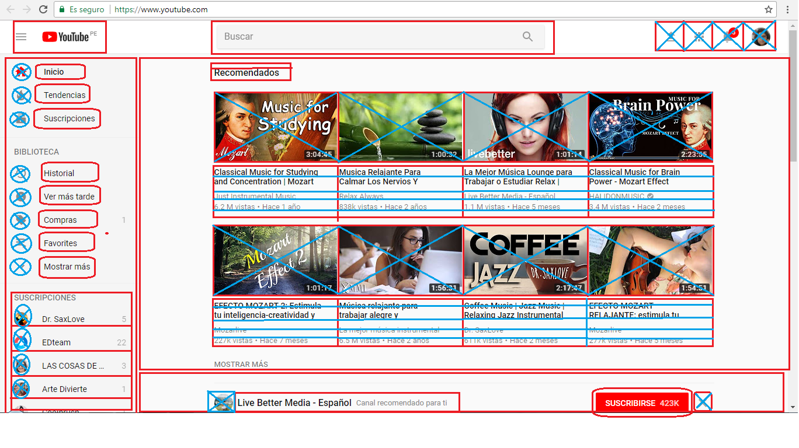
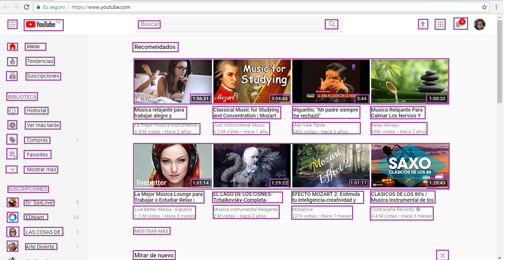

# Identificar en la pagina Web de Youtube, cual es la parte UX y UI

## Idenficicaciòn de prototipo UX de pàgina Youtube.

1. Como parte del aprendizaje se creo un protitipado incluyendo figuras geometricas.
	. Los cuadrados rojos son las secciones que estaran conteniendo botones e iconos con funcionalidad.
	. Las circunferencias marcadas incluyen un icono o una imagen con forma redonda.
	. Los cuadrados mas grandes marcados son videos de recomendaciones.
	. Los cuadrados con lineas horizontales son textos que incluyen la descripcion del video.

2. Todo el prototipo es la forma como esta distribuido los botones y funcionalidades en la pagina principal de Youtube.

## Idenficicaciòn de prototipo UI de pàgina Youtube.

1. Como parte del aprendizaje se creo un protitipado se incluye solo cuadrados bordeando cada uno de los iconos, imagenes y texto todos en color morado.
	. Las partes marcadas son las mismas que en UX, la diferencia es que en UI, nos enfocaremos en los stylos.
		. Los iconos de color rojo.
		. Las fotografia en la barra de navegaciòn, y en las recomendaciones de los videos
		. El estilo de letra de la cabecera, los iconos de biblioteca y suscripciones, la descripcion del video, estilo, negrita, 	  colores plomos, negros.
		. El estilo del tiempo del video,letra y fondo negro.

2. Todo el prototipo de UI, esta basado en los estilos que se usan para el que proyecto UX, se vea genial, hablamos de tipos de letras, colores, fondos, etc.